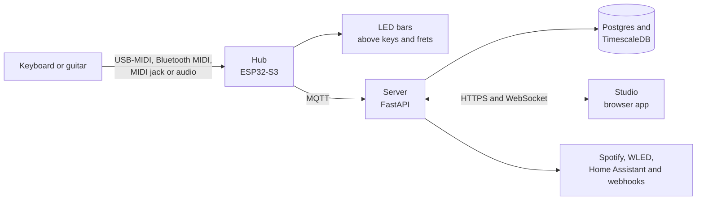

<picture>
  <source media="(prefers-color-scheme: dark)" srcset="https://raw.githubusercontent.com/melophos/melophos/main/assets/brand/melophos-wordmark-dark.svg">
  
</picture>

**Song made visible.** An open instrument learning platform.

[Documentation](https://github.com/melophos/melophos/tree/main/docs) · [Roadmap](https://github.com/orgs/melophos/projects/1) · [Discussions](https://github.com/melophos/melophos/discussions) · [Contributing](https://github.com/melophos/melophos/blob/main/CONTRIBUTING.md)

## Why MELOPHOS

I have monocular vision, which makes judging depth and scanning across a wide 88-key keyboard harder than it looks. Light-up keyboards helped, but every one I found was locked to one brand's app, one instrument and a subscription.

MELOPHOS is the tool I wanted: lights on a single flat line right where my hands are, any instrument I own now or later and my practice data kept on my own server. The name is pronounced MEL-oh-fos, from the Greek *melos* (song) and *phos* (light).

## How it works

The hub sits behind the instrument, reads every note and lights the notes to play next. It sends each practice session to a server you host yourself, where a Rust scoring engine measures accuracy and timing. Studio, the browser app, holds the song library and shows your progress. The full picture is in [docs/architecture.md](https://github.com/melophos/melophos/blob/main/docs/architecture.md).

## What it does

- **Light-guided practice.** LEDs above each key or along a fretboard show the next notes to play. Melody waits for the right note, Rhythm holds a set tempo and Listen plays the piece through.
- **Any instrument.** Notes arrive over USB-MIDI, Bluetooth MIDI, MIDI jacks or an audio input. Each instrument is described by an open profile, so a new keyboard or a guitar is a configuration change rather than a rebuild.
- **Practice you can see.** Every note is logged against a session and the server turns sessions into streaks, accuracy, tempo progress and per-key heatmaps.
- **Accessible by design.** Guidance sits on one flat line, colour is never the only signal and timing cues are visual as well as audible.
- **Self-hosted.** One `docker compose` command runs the whole server stack on a home server or a small VPS.
- **Open hardware and software.** CERN-OHL-S boards and AGPL code, with every design file in the open.

## Where it stands

> [!NOTE]
> MELOPHOS is in early development. The scaffold for every component builds and tests clean. I am now bringing up the LEDs and MIDI input on the bench.

| Milestone | What it covers |
| --- | --- |
| [v1: works on a real piano](https://github.com/melophos/melophos/milestone/1) | The hub and LED bars on a real piano, USB and Bluetooth MIDI, the three practice modes, the scoring engine and the first Studio |
| [v2: platform](https://github.com/melophos/melophos/milestone/2) | Remote lessons over WebRTC, audio and video song import, a Spotify learn list, room lights and one-command installs |
| [v3: any instrument](https://github.com/melophos/melophos/milestone/3) | Guitars through the fret bar, a fingering coach, an optical sensor bar for acoustic pianos and a kit for other builders |

The written plan, with targets for each version, is in [docs/roadmap.md](https://github.com/melophos/melophos/blob/main/docs/roadmap.md).

## Built with

| Layer | Stack |
| --- | --- |
| Hub firmware | C++ on the ESP32-S3 with PlatformIO and FastLED |
| Hardware | KiCad schematics and PCB layouts |
| Scoring engine | Rust, compiled to WebAssembly for Studio and to a Python module for the server |
| Server | Python and FastAPI, with Postgres, TimescaleDB and MQTT |
| Studio | TypeScript and Vite, with WebMIDI and Web Bluetooth |
| Developer tools | Python client and hub simulator |
| Instrument profiles | JSON against one shared schema |

## Repositories

| Repository | What it is |
| --- | --- |
| [melophos](https://github.com/melophos/melophos) | The monorepo where all development happens. Start here |
| [firmware](https://github.com/melophos/firmware) | ESP32-S3 hub firmware in C++ |
| [hardware](https://github.com/melophos/hardware) | KiCad designs for the hub, octave LED bars and fret bar |
| [core](https://github.com/melophos/core) | Scoring engine in Rust, for the browser and the server |
| [server](https://github.com/melophos/server) | Self-hostable FastAPI server and Docker Compose stack |
| [studio](https://github.com/melophos/studio) | Browser app for practice, songs and hub setup |
| [client](https://github.com/melophos/client) | Python client and a hub simulator |
| [profiles](https://github.com/melophos/profiles) | Instrument profiles and their schema |
| [docs](https://github.com/melophos/docs) | Architecture, protocol, roadmap and guides |

Every component repository is a read-only copy published from the monorepo. Issues, discussions and pull requests all go to [melophos/melophos](https://github.com/melophos/melophos).

## Get involved

- **Start here:** the [welcome post](https://github.com/melophos/melophos/discussions/47) and the [roadmap post](https://github.com/melophos/melophos/discussions/48)
- **Try it without a hub:** [run MELOPHOS on a laptop](https://github.com/melophos/melophos/discussions/60) with the hub simulator
- **Questions and ideas:** [Discussions](https://github.com/melophos/melophos/discussions), with [Q&A](https://github.com/melophos/melophos/discussions/categories/q-a) for help and [Research](https://github.com/melophos/melophos/discussions/categories/research) for papers and datasets
- **Bugs and feature requests:** [issues on the monorepo](https://github.com/melophos/melophos/issues/new/choose)
- **First contribution:** an [instrument profile](https://github.com/melophos/melophos/blob/main/profiles/README.md) for a keyboard or guitar that is not covered yet
- **Contributing:** the [contributing guide](https://github.com/melophos/melophos/blob/main/CONTRIBUTING.md)
- **Security:** report vulnerabilities privately through the [security policy](https://github.com/melophos/melophos/security/policy)

## Licence

The software is licensed under AGPL-3.0-or-later and the hardware designs under CERN-OHL-S-2.0. [NOTICE.md](https://github.com/melophos/melophos/blob/main/NOTICE.md) explains which licence covers what.
